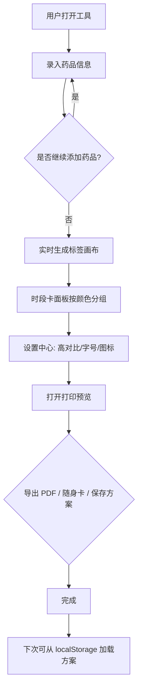

## 1. 产品概述

「药盒标签放大排版与服药时段卡生成器」是一款纯前端离线可用的家庭适老打印工具，帮助子女为家中老人把药盒上的小字重新排版成大字版贴纸、颜色区分的时段卡和便于打印的药盒标签，解决老人看不清药盒说明、临时手写纸条易丢失的问题。
- 目标用户：有老人需要长期服药的家庭照护者（子女、家属）
- 核心价值：把模糊难读的服药信息转化为“看得清、分得清、带得走、打得印”的适老化卡片，离线可用、零隐私上传

## 2. 核心功能

### 2.1 用户角色
| 角色 | 注册方式 | 核心权限 |
|------|----------|----------|
| 家庭照护者 | 无需注册，直接使用 | 录入药品、生成标签、保存方案、导出 PDF |

### 2.2 功能模块
1. **药品录入区**：药品名称、服用频次、饭前/饭后、早中晚时段、单次剂量、注意事项
2. **标签画布**：大字版贴纸实时预览、颜色与图标区分、同类药品分组
3. **时段卡面板**：早/中/晚颜色区分卡、图标提示、时段汇总
4. **打印预览**：A4/A5/标签纸多纸张排版、导出 PDF、生成简版随身卡
5. **设置中心**：高对比模式、字号级别（大/超大/特大）、图标提示开关
6. **方案管理**：保存方案到 localStorage、加载/删除历史方案

### 2.3 页面详情
| 页面名称 | 模块名称 | 功能描述 |
|-----------|----------|----------|
| 工作台（单页应用） | 顶部导航栏 | Logo、方案保存/加载、高对比切换、字号级别、导出 PDF |
| 工作台 | 药品录入区 | 表单录入药品信息，支持同类药品分组标签、添加/删除药品、实时校验 |
| 工作台 | 标签画布 | 实时渲染大字版贴纸，支持纸张选择、排版预览、图标提示 |
| 工作台 | 时段卡面板 | 按 早/中/晚 自动汇总药品，颜色与图标区分，点击可放大查看 |
| 工作台 | 打印预览弹层 | 全屏预览不同纸张排版，一键导出 PDF、生成随身卡 |
| 工作台 | 方案抽屉 | 已保存方案列表、加载、删除、重命名 |

## 3. 核心流程

用户打开工具 → 在录入区填写药品信息（名称、频次、饭前饭后、时段、剂量、注意事项）→ 系统实时在标签画布生成大字版贴纸，在时段卡面板按颜色分组 → 用户在设置中心调整高对比/字号/图标 → 打开打印预览选择纸张并导出 PDF 或随身卡 → 保存方案到 localStorage 供下次加载。

## 4. 用户界面设计

### 4.1 设计风格
- **主色调**：温暖琥珀色（#E8A33D）作为主色，传递关怀与温暖；晨曦橙（早）、薄荷绿（中）、暮霭蓝（晚）三色区分时段
- **次色**：米白纸张底（#FAF6EE）、墨黑文字（#1F1A14），高对比模式下为纯黑底纯白字
- **按钮风格**：大号圆角矩形按钮，主操作按钮采用实色填充+轻微下沉阴影，次要操作为描边样式
- **字体**：标题使用思源宋体（Noto Serif SC）传递稳重感，正文与标签使用思源黑体（Noto Sans SC）保证清晰易读；药盒标签正文采用等宽加粗处理
- **布局风格**：桌面优先三栏布局——左侧录入区、中间标签画布、右侧时段卡面板，顶部通栏设置
- **图标/emoji 风格**：使用线性描边图标，早=☀️、中=🌞、晚=🌙、饭前=🍚、饭后=🍲，搭配语义色块

### 4.2 页面设计概览
| 页面名称 | 模块名称 | UI 元素 |
|-----------|----------|----------|
| 工作台 | 顶部导航栏 | 暖色背景、Logo、保存/加载/导出按钮、高对比开关、字号切换、纸色质感 |
| 工作台 | 药品录入区 | 卡片式表单、大号输入框、频次/时段选择器、注意事项多行文本、分组标签 |
| 工作台 | 标签画布 | 纸张质感背景、大字贴纸卡片、图标色块、虚线裁切线、缩放预览 |
| 工作台 | 时段卡面板 | 早中晚三色分栏卡片、药品列表、图标提示、点击放大 |
| 工作台 | 打印预览弹层 | 全屏暗背景、纸张预览、纸张切换、导出按钮、随身卡缩略图 |

### 4.3 响应式
- 桌面优先：≥1200px 三栏并排布局
- 平板（768-1199px）：录入区与画布上下排布，时段卡面板折叠为底部抽屉
- 移动端（<768px）：单列堆叠，录入区可折叠，画布与时段卡通过 Tab 切换
- 触摸优化：所有交互按钮最小 48px 触摸区，输入框放大

### 4.4 无障碍与适老
- 字号级别：大（18px）/超大（22px）/特大（28px）三档
- 高对比模式：纯黑底纯白字，色块保留语义色但提高饱和度
- 图标提示：所有关键信息同时提供文字+图标，避免仅靠颜色区分
- 焦点可见：键盘导航时清晰的焦点环
