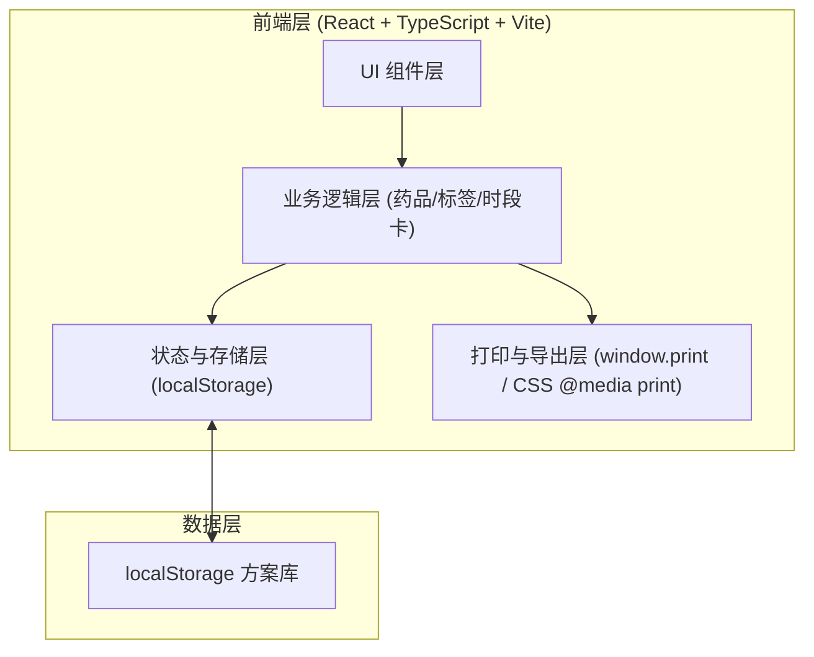
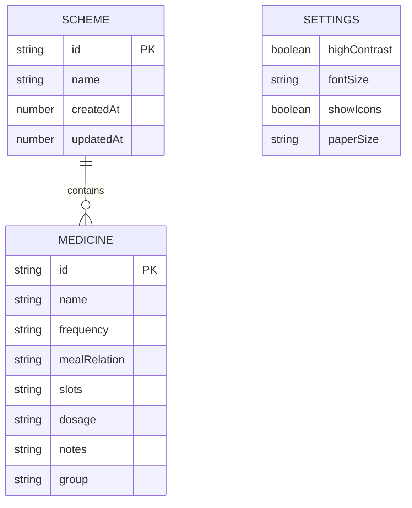

## 1. 架构设计

纯前端单页应用，所有数据存储在浏览器 localStorage，无后端服务，PDF 导出依赖浏览器原生打印能力。



## 2. 技术说明
- 前端：React@18 + TypeScript + Vite
- 样式：Tailwind CSS@3
- 图标：lucide-react
- 字体：Google Fonts（Noto Serif SC / Noto Sans SC）
- 初始化工具：vite-create
- 后端：无（纯前端离线工具）
- 数据库：无，使用 localStorage 持久化方案

## 3. 路由定义
| 路由 | 用途 |
|-------|------|
| / | 工作台单页，承载录入区、标签画布、时段卡面板、打印预览弹层 |

## 4. API 定义
无后端 API。所有数据交互通过 localStorage 完成，定义以下 TypeScript 类型：

```typescript
type TimeSlot = 'morning' | 'noon' | 'evening';
type MealRelation = 'before' | 'after' | 'empty' | 'any';

interface Medicine {
  id: string;
  name: string;
  frequency: string;
  mealRelation: MealRelation;
  slots: TimeSlot[];
  dosage: string;
  notes: string;
  group?: string;
}

interface Scheme {
  id: string;
  name: string;
  medicines: Medicine[];
  createdAt: number;
  updatedAt: number;
}

interface Settings {
  highContrast: boolean;
  fontSize: 'large' | 'xlarge' | 'xxlarge';
  showIcons: boolean;
  paperSize: 'A4' | 'A5' | 'label';
}
```

## 5. 服务器架构图
无后端服务，不适用。

## 6. 数据模型
### 6.1 数据模型定义
使用 localStorage 存储，键名设计：



### 6.2 数据定义语言
localStorage 键值约定：
- `medlabel:schemes` — 方案列表 JSON 数组
- `medlabel:settings` — 用户设置 JSON 对象
- `medlabel:current` — 当前编辑中的方案 id
